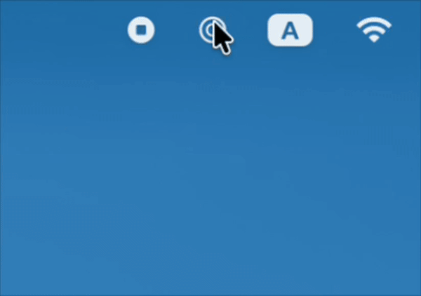

# CR Coin Flip

A tiny native macOS menu bar app for flipping a coin. Click the icon, hit **Flip a Coin**, get **Heads!** or **Tails!** — 50/50, that's it.

Built with SwiftUI/AppKit (`NSStatusItem`) as a small project to learn native macOS app development.

## Requirements

- macOS
- Xcode

## Running

Open `CRCoinFlip.xcodeproj` in Xcode and press Run.

## Downloading

Release builds are available as a zipped `.app` on the [Releases page](https://github.com/crondito/CRCoinFlip/releases).

This app is distributed for free and is not notarized. If macOS blocks it after download, go to **System Settings > Privacy & Security** and choose to open it anyway.

## License

This project is available under the MIT License.
